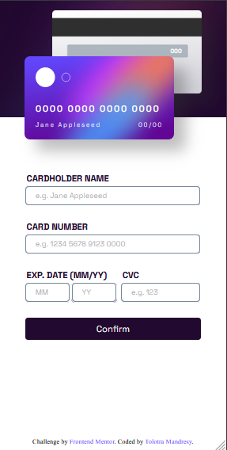

# Frontend Mentor - Interactive card details form solution

This is a solution to the [Interactive card details form challenge on Frontend Mentor](https://www.frontendmentor.io/challenges/interactive-card-details-form-XpS8cKZDWw). Frontend Mentor challenges help you improve your coding skills by building realistic projects. 

## Table of contents
  - [Link](#link)
  - [The challenge](#the-challenge)
  - [Screenshot](#screenshot)
    - [Built with](#built-with)
    - [What I learned](#what-i-learned)
  - [Author](#author)

## Link
Click [here](https://live-editing.netlify.app/) to open the solution I've implemented

## The challenge

Users should be able to:

- Fill in the form and see the card details update in real-time
- Receive error messages when the form is submitted if:
  - Any input field is empty
  - The card number, expiry date, or CVC fields are in the wrong format
- View the optimal layout depending on their device's screen size
- See hover, active, and focus states for interactive elements on the page

## Screenshot
Here all screenshots from the challenge I've implemented
  
  
  
   
   
## Built with
- Semantic HTML5 markup
- CSS custom properties
- Flexbox
- Mobile-first workflow

## What I learned
- using flexbox
- some basic comportement of Javascript, hoisting, using RegExp

## Author

- Linkedin: [Tolotra Mandresy](https://linkedin.com/in/tolotra-mandresy-r-718329235)
- Facebook: [Tolotra Mandresy](https://web.facebook.com/profile.php?id=100008409820824)
- Frontend Mentor - [@TolotraMandresy](https://www.frontendmentor.io/profile/TolotraMandresy)
